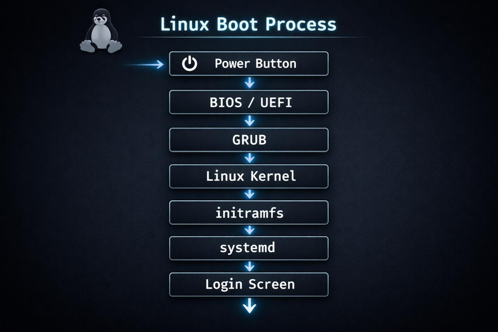
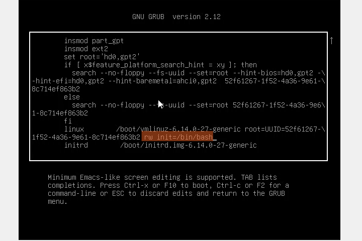
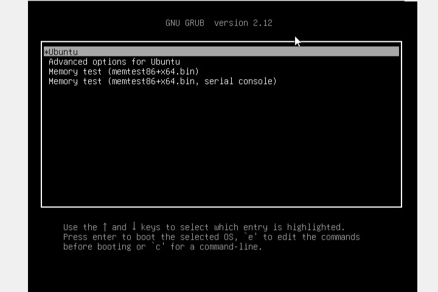
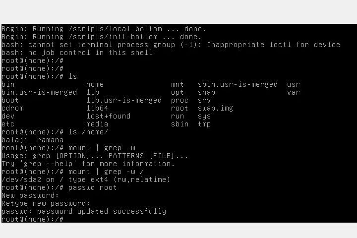

## 🔐 Linux System Recovery & Boot-Level Security Hardening

## 📌 Project Overview
This project demonstrates Linux password recovery techniques and bootloader-level security hardening on Ubuntu 24.04. It highlights how attackers can exploit the GRUB bootloader and how to mitigate such risks using authentication and access control.

---

## 🎯 Objectives
- Recover lost Linux user password without reinstalling OS
- Understand the Linux boot process
- Identify bootloader vulnerabilities
- Prevent unauthorized root access

---

## 🧠 Linux Boot Architecture

**Boot Flow:**

BIOS/UEFI → GRUB → Kernel → initramfs → systemd → Login

---

## ⚠️ Problem Statement

Default Ubuntu systems allow attackers to exploit GRUB bootloader by editing boot parameters.

### GRUB Edit Attack (Before Hardening)

The attacker modifies kernel parameters (`init=/bin/bash`) to gain unauthorized root shell access without authentication. This represents a critical boot-level security vulnerability.

This provides root shell access without authentication.

---

## 🔓 Part 1: Password Recovery Using GRUB

### Step 1: Access GRUB Menu
- Restart system
- Press **Shift / Esc**

### Step 2: Edit Boot Entry
Press:
e

### Step 3: Modify Kernel Line

Find:
linux /boot/vmlinuz-... ro quiet splash

Replace with:
linux /boot/vmlinuz-... rw init=/bin/bash

---

### Step 4: Boot into Root Shell
Press:
Ctrl + X

---

### Step 5: Reset Password

mount -o remount,rw /
ls /home
passwd <username>

---

### Step 6: Reboot

exec /sbin/init

---

## 🔐 Part 2: GRUB Security Hardening

### Step 1: Generate Password Hash

sudo grub-mkpasswd-pbkdf2

---

### Step 2: Configure Superuser

Add:
set superusers="admin"
password_pbkdf2 admin <hashed-password>

---

### Step 3: Remove Unrestricted Access

sudo nano /etc/grub.d/10_linux

Remove:
--unrestricted

---

### Step 4: Apply Changes
sudo update-grub

---

## 🧪 Attack Simulation

### ❌ Before Hardening
| Attack            | Result      |
|------------------|------------|
| GRUB Edit        | Allowed     |
| init=/bin/bash   | Root Access |

---

### ✅ After Hardening
| Attack            | Result              |
|------------------|--------------------|
| GRUB Edit        | Password Required  |
| Recovery Mode    | Restricted         |
| Root Shell       | Blocked            |

---

## 🔍 Verification
- Reboot system
- Press `e` in GRUB
- Confirm password prompt appears

---

## 🔐 Security Insights
- GRUB is a critical attack surface
- Physical access can lead to full compromise
- Bootloader security is essential in production systems

---

## 🧰 Tools & Technologies
- Ubuntu 24.04
- GRUB Bootloader
- Bash
- Linux Administration

---

## ✅ Result
Successfully prevented unauthorized root access using GRUB authentication and bootloader hardening.

---
